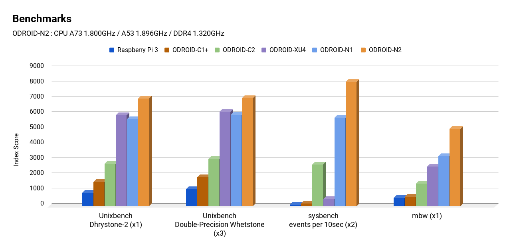
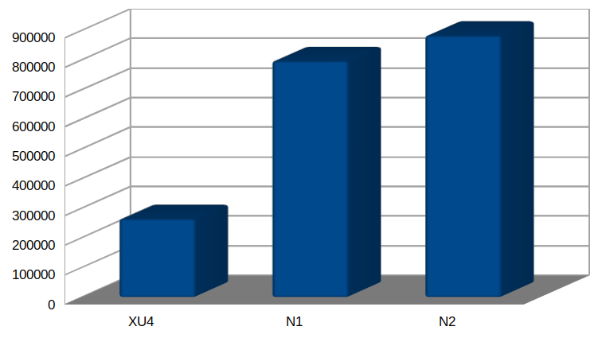
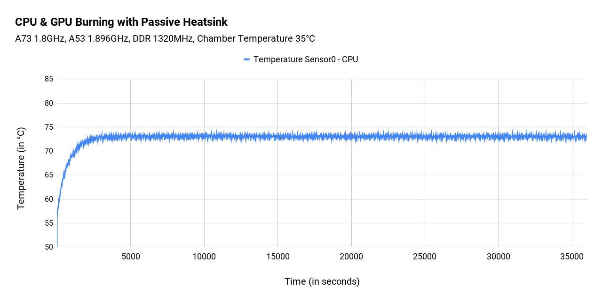
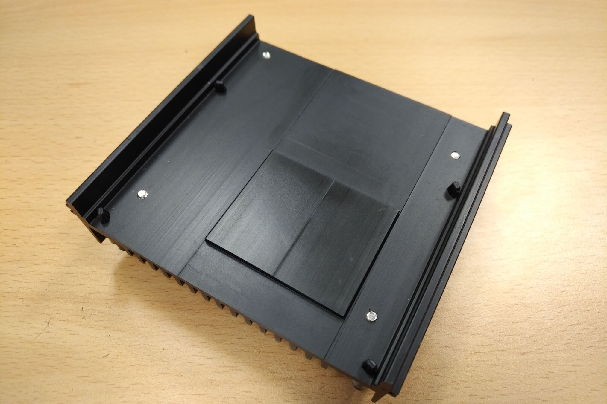
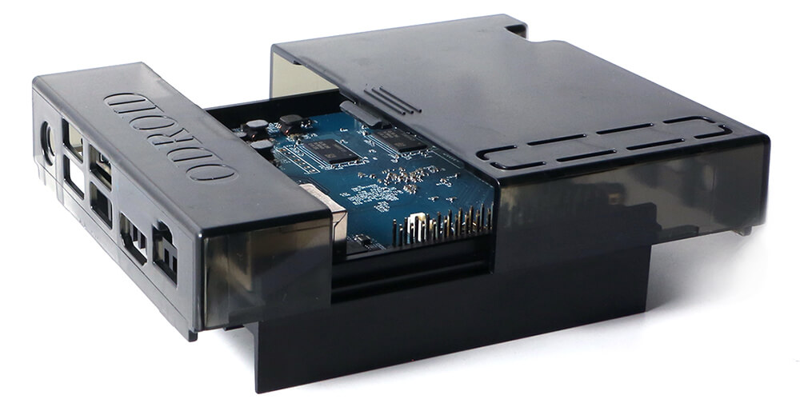

# Quick Preview of ODROID N2

The following is not a real review but just a quick collection of what we already know and what's missing yet.

## Overview

This new ODROID board is 90x90x17mm in size (100x91x25mm heatsink included and slightly larger with plastic cover) not following any established form factor. It's not just a board but a combination of board and huge heatsink able to dissipate heat out of an enclosure unlike 'usual' heatsinks (due to the SoC being on the appropriate PCB side --> the lower... which can be turned to 'upper' by people able to flip physical things by 180°. Surprisingly few people are not able to understand such basic stuff).

For a lot of details including enclosure variants see [Hardkernel's announcement thread](https://forum.odroid.com/viewtopic.php?t=33781). Here are just some quick specs:

* Amlogic S922X SoC
* 4 DDR4 modules soldered resulting in either 2GB or 4GB maximum DRAM size.
* All 4 USB3 receptacles connected to an internal GL3523 USB3 hub connected to the SoC's single USB3 host controller (no PCIe capabilities here since with S922X it's either USB3 or PCIe since signals are pinmuxed)
* Micro USB (USB2 OTG)
* 1 x Gigabit Ethernet using SoC's internal GbE MAC combined with an RTL8211F transceiver
* HDMI 2.0 and CVBS output
* RTC with backup battery
* high quality Audio DAC
* various Audio interfaces
* multiple low-speed interfaces available on 40 pin GPIO header
* the usual socket connector to make use of Hardkernel's eMMC modules (most probably also compatible ones from Ameridroid, Pine64 or Radxa)
* onboard 8 MiB NOR flash containing bootloader stuff
* SD-card slot
* Sane powering through 5.5/2.1mm barrel plug with wide voltage range input (no 'powered with 5V' sh*t show possible!)

Amlogic is famous for making good media player SoCs (target audience: TV box consumers using Android) and this should also be the domain of ODROID N2 even when running with Linux later and not just Android. Since I'm not that much into details with this use case (no interest in display, GPU and VPU) I won't cover any more details here. Simply visit vendor's site for any details on this.

Hardkernel positions their new N2 as a stronger successor of their [canceled N1](https://forum.odroid.com/viewtopic.php?f=149&t=31277) and as such they focus in their announcement on trying to point out where N2 would be superior compared to N1 (based on RK3399). Below we will see whether this makes that much sense or not if you're an average buyer and not a Hardkernel employee or fanboy.

## Software support Status

As known from Hardkernel they did not just take Amlogic's BSP (board support package) and added their own patches to this but rebased the Amlogic kernel sources to the respective LTS/mainline kernel version so they're able to continually merge upstream kernel updates/fixes into their sources.

Amlogic's BSP bases on a 4.9 kernel lacking tons of fixes but due to Hardkernel efforts  N2 starts with a 4.9.156 kernel, that's latest 4.9 LTS version (LTS --> long term support). The good news is that version 4.9 that was already marked EOL at the end of 2018 just recently got its lifetime extended [until Jan 2023](https://www.kernel.org/category/releases.html) due to upstream kernel maintainers wanting to take care of 4.9 at least until then. The other good news is that Amlogic themselves are busy with upstreaming software support for their new 'mesong12' SoCs (S992X and A311D is *mesong12b* while the less performant S905X2/S905D2 for example are called *mesong12a*).

You won't find any details about transcoding or display related stuff (VPU, GPU) here since I'm too clueless in this area so check out Hardkernel's info over at their site ('Wayland driver a few months later', no X11, and so on).

## S922X

At N2's heart there's the new Amlogic S922X SoC. It consists of 4 x A73 CPU cores able to run at 1.8GHz in idle and 2 x A53 CPU cores able to run at 1.9 GHz in idle (HK provides slight overclocking settings we'll look into below). The SoC also contains a Mali G52 GPU and is equipped with ARMv8 Crypto Extensions, a Cortex-M4 for 'voice processing' and similar stuff and a Cortex-M3 for 'power management' (this one fully controlling thermals, DVFS and clockspeeds).

Currently there's still no SoC datasheet or manual publicly available.

On some Amlogic marketing material it's written the SoC would be manufactured in a 12 nm process which has to result in high clockspeeds at low consumption with low heat generation at the same time. Unlike older fab nodes like '28nm' these '12nm' are mostly [marketing BS](https://www.eenewsanalog.com/news/report-tsmc-relabel-process-12nm) and if CPU cores made in a 'better' process like Amlogic's 12nm are outperformed by older SoCs made in a 'worse' 28nm process what is this babbling about 'more advanced' fab nodes all about?

As usual you'll find some information on cnx-software.com by [using the search field in the upper right corner there](https://www.cnx-software.com/?s=S922X). Most recent update about detailed SoC specs is [here](https://www.cnx-software.com/2018/10/21/comparison-s905x-s905x2-s905x2-processors/).

As can be seen there and [as already announced over a year ago](https://www.cnx-software.com/2018/01/10/amlogic-2018-roadmap-reveals-s905x2-s905c-and-s922-processors/) this SoC has PCIe capabilties (one x1 Gen2 lane) but the data lanes seem to be pinmuxed with USB3 and as such it was an easy decision for Hardkernel to prefer USB3 over PCIe here. Majority of their customers wants to attach USB stuff and due to PCIe being just a single lane implementation if they would have opted for PCIe exposed from S922X they would have to add a PCIe attached USB3 host controller which kinda makes no sense at all. Since if you simply add one USB3 controller to the single PCIe lane all you get is higher costs and if you want to make PCIe available in addition to USB3 then you'll need to add a PCIe switch/multiplexer which further increases both hassles and costs and now you deal with shared bandwidth in addition. 

Also currently nobody seems to know how performant and reliable Amlogic's PCIe implementation is (based on Synopsys Designware, but same is true for Allwinner H6 and there [implementation details simply suck](http://linux-sunxi.org/Linux_mainlining_effort#cite_note-h6-pcie-4) and make PCIe more or less unusable). For some use cases using PCIe instead of USB3 would make a lot more sense, especially if low latency is needed but since it's either or and N2 should be priced competitively IMO it makes a lot of sense to expose USB3 instead (even if the integrated USB3 host controller might be somewhat quirky as we've seen with majority of other USB3 implementations on ARM SoCs already).

## Benchmarks

### Networking and storage

The easy stuff first: Hardkernel reports Gigabit Ethernet maxing out at ~940 MBits/sec in each direction which is simply the maximum you could get. USB3 storage results also look good. They report ~340MB/s with a 1MB block size which is comparable to [what RK3399 is capable of](https://forum.armbian.com/topic/1925-some-storage-benchmarks-on-sbcs/?do=findComment&comment=51350). 

Since they do not show results for 16MB block size (around 400 MB/s with N1/RK3399) I would assume S922X is slower than RK3399 with really large block sizes. Anyway ~340MB/s is just fine for use cases where sequential transfers are important (normally then used with HDDs which are slower anyway). For the majority of use cases not sequential IO is key but high random IO (low latency and high IOPS). Maybe they have a reason to not show 4K random access performance numbers for N2 though it's hard to measure since you need the very same and very fast SSD worn out in an identical way to get comparable numbers between different USB3 host controller implementations (one of the reasons I used the very same SSD for almost all of my tests linked above to and always made a reference benchmark with the fastest implementation first to see whether the SSD is still able to show top performance)

Both SD card and eMMC performance is fine but eMMC access somewhat lower as on their RK3399 based N1 given they tested with the same 'orange' Samsung eMMC 5.1 modules. With RK3399/N1 sequential reads were twice as fast (300 MB/s vs. 150 MB/s) and also random IO performance was somewhat better ([Full details](https://forum.armbian.com/topic/6496-odroid-n1-not-a-review-yet/?do=findComment&comment=49404) but please keep in mind that sequential transfer speeds are irrelevant with most use cases so 300 MB/s vs. 150 MB/s is nothing to worry about, same with random IO performance where S922X/N2 is only slightly slower than RK3399/N1 so this simply doesn't matter. Performance differences less than 10% should be considered not relevant)

Wrt USB3 performance you should keep in mind that there's always an internal USB3 hub in between so with more than one demanding device connected to USB ports it's always shared bandwidth and potential bus contention issues. Better not try to attach a bunch of USB3 disks to N2 (applies to other boards like NanoPi M4 with same '4 ports behind USB3 hub' topology too but there you also need to fear reliability issues to due crappy 5V USB-C powering)

### GPU performance ###

No idea, Hardkernel provides a bar chart showing *glmark2-es2 --off-screen* numbers I've no idea how to interpret (maybe that's the stuff where teapots and horses rotate).

### CPU performance ###

That's the most interesting part at least for me but still almost no real information available.

Hardkernel's choice of benchmarks is simply weird and maybe only understandable if we keep in mind that they need to show their RK3399 based N1 was canceled for a reason and N2 would be the better successor (their claim is 'more powerful, more stable, and faster performing than N1')

* Unixbench *Dhrystone* is a mess. With today's CPUs the whole benchmark runs inside the CPU caches (so what about DRAM access that often bottlenecks real-world applications?). It's also mostly a compiler benchmark and can not be used to compare different systems as long as they don't run exactly the same software stack. See [here](http://www.brendangregg.com/blog/2014-05-02/compilers-love-messing-with-benchmarks.html) for details.
* Unixbench *Whetstone* is the same mess. Reasons as above.
* *Sysbench* is an insane mess. When using same sysbench version depending on compiler version or flags [we get performance differences of up to 50% on same hardware](https://forum.armbian.com/topic/1748-sbc-consumptionperformance-comparisons/?do=findComment&comment=35655). Sysbench when compiled for ARMv8 executes [15 times faster](https://forum.odroid.com/viewtopic.php?f=136&t=19158#p127240) compared to ARMv7. Different sysbench versions spit out totally different numbers (e.g. [sysbench 0.5 performs 30% slower than sysbench 0.4.12](https://forum.armbian.com/topic/1917-armbian-running-on-pine64-and-other-a64h5-devices/) which is default on Ubuntu 16.04 while in Ubuntu 18.04 HK uses now with N2 it's version 1.0.11 which produces totally unrelated numbers). Comparing sysbench numbers is impossible without knowing exact sysbench version, compiler version and flags. Showing at least 15 times faster execution on 64-bit ARMv8 systems makes it irrelevant for SoC comparisons anyway (so what's the reason HK used sysbench here? Showing that N2 would be a lot faster than good old XU4?)
* *mbw* is used to demonstrate that '1320Mhz-DDR4 is 35% faster than 800Mhz-DDR3' (N1 vs. N2). The lower scores with N1 are due to Hardkernel over a year ago testing with Rockchip's default kernel settings using *CONFIG_HZ=1000* while everyone else around uses *CONFIG_HZ=250*. This simple change results in RK3399 showing way lower memory bandwidth scores compared to running with *CONFIG_HZ=250*. With identical kernel settings memory bandwidth benchmarks most probably show almost identical scores.
* *7-zip* only in *multi-threaded mode* is used to show a 20% performance increase of N2 compared to N1. Strange details: HK now talks about RK3399's A72 cores running just with 1.8 GHz (while last year they operated them with 2 GHz). Just 20% higher performance when comparing those two hexa-core SoCs indicates there's something wrong. N2/S922X has 4 fast A73 cores and 2 little A53 while N1/RK3399 has just 2 fast A72 but 4 little A53. Given that all cores on S922X should be clocked as fast or faster than on RK3399 and given that big cores should outperform little ones pretty easy (with A72@1.8GHz vs. A53@1.5GHz it's big cores performing +50% better) this 20% increase is way too low. Being able to look at single-threaded scores of A73 and A53 cores individually would help getting a clue what's going on but Hardkernel refuses to do so [obviously for a reason](https://forum.odroid.com/viewtopic.php?f=176&t=33813#p246193).
* Finally Hardkernel also showed results for S922X's use of ARMv8 Crypto Extensions (almost all 64-bit ARM SBC can make use of except ODROID-C2, Raspberry Pi 3/3+ and NanoPi K2). Surprisingly they chose *sha256* instead of *aes-256-cbc* which would've made their measurements [comparable to a bunch of other boards/SoCs](https://github.com/ThomasKaiser/sbc-bench/blob/master/Results.md). And when trying to comprehend what they measured I got a [better score with N1/RK3399 than N2/S922X](https://www.cnx-software.com/2019/02/13/odroid-n2-amlogic-s922x-sbc/#comment-560645) so with this single-threaded test I don't see how N2 would outperform N1 or how N2 performs at all.

Also it's a bit disturbing that Hardkernel so far only published multi-core benchmark results while single-threaded performance is way more important for the vast majority of their users and use cases. With the one single-threaded test (openssl not testing CPU performance but a 'special engine' called ARMv8 Crypto Extensions) the scores are dubios. What's the reason for this?

The choice of benchmark tools and the execution modes seem to be solely focused on creating the impression HK's N2 would be faster than their own abandoned N1 unfortunately not providing any real insights.

Another rather dangerous attempt to compare performance is to look at Geekbench scores. [Here](https://browser.geekbench.com/v4/cpu/11957170) Amlogic's reference design board for S922X running a 64-bit kernel combined with a 32-bit Android userland measured with 32-bit Geekbench 4.0.4 showing a single-core score of 1261 and multi-core score of 3778 (ARMv8 Crypto Extensions not active so when measured with [Geekbench 4.1 or above](https://www.geekbench.com/blog/2017/03/geekbench-41/) these scores will slightly improve -- Geekbench total scores are calculcated as follows: Cryptography: 5%, Integer 45%, Floating Point: 30%, Memory: 20%)

When comparing with something similar to ODROID-N1 ([RK3399 Firefly with similar cpufreq settings as N1](https://browser.geekbench.com/v4/cpu/5508812)) we're talking about single-core scores of 1405 and 3114 multi-core. Due to different Geekbench versions and modes of execution results are not really comparable but provide at least an impression of N2 not shining wrt single-threaded performance compared to N1/RK3399. Further tests needed or let's better say strange that these tests haven't been done yet by Hardkernel.

## Thermals, cpufreq behavior, 'overclocking'

All 64-bit Amlogic SoCs contain one Cortex-M core responsible for 'power management'. This core's firmware gets loaded when the SoC boots (as part of ATF -- ARM Trusted Firmware -- and is therefore cryptographically signed. Replacing this firmware is not that easy). The Cortex-M controls thermal, cpufreq and DVFS behavior and as such the stuff defined in Linux (device-tree definitions) has lower precedence.

Amlogic has a long history of 'cheating' with reported clockspeeds. Linux/kernel cpufreq scaling driver has no idea what's really going on therefore reporting running at bogus clockspeeds while the Cortex-M's firmware sets totally different clockspeeds in reality. Most 'famous' indication of this was Amlogic S905 on ODROID-C2 being limited to 1.5 GHz while reporting to run at 2.0 GHz at the same time (see [here](https://www.cnx-software.com/2016/08/28/amlogic-s905-and-s912-processors-appear-to-be-limited-to-1-5-ghz-not-2-ghz-as-advertised/) and [there](https://forum.armbian.com/topic/7042-amlogic-still-cheating-with-clockspeeds/) for details). Back then Hardkernel managed to get a Cortex-M firmware from Amlogic that led to consistent results of what Linux set and reported and what happened in reality.

With other SoCs and board vendors situation was different and Amlogic still only provided 'cheating' firmwares limiting the CPU cores to lower clockspeeds than reported (see NanoPi K2, Vim, Vim2 and Le Potato -- all of them are affected by a cheating firmware limiting the max cpufreq to lower values than reported). From a SoC vendor's perspective this behavior of controlling DVFS/cpufreq from their own restricted firmware can make a lot of sense since they assure proper operation while letting Android tools like CPU-Z or Geekbench report the faked higher clockspeeds (it's important to keep in mind that Amlogic's only goal is selling their SoCs as part of millions of TV boxes running Android to clueless consumers. The few thousand Linux users and their demands really don't matter at all).

When checking [Hardkernel's 'overclocking' documentation](https://wiki.odroid.com/odroid-n2/application_note/software/set_cpu_freq) it's pretty obvious that on S922X the Cortex-M is still in charge of DVFS (dynamic voltage frequency scaling --> the higher the clockspeeds the higher the supply voltage). You can try to allow higher clockspeeds but since you can't also modify vCore supply voltage by fully controlling DVFS operating points you may run into instabilities. Amlogic's closed firmware fully controls the hardware.

As such looking into DVFS definitions in device-tree files is rather useless, same with trying to adjust thermal behavior by adjusting thermal trip points in DT. The rather useless 'thermal throttling test' Hardkernel conducted is a nice example:

Hardkernel runs a demanding task (*stress-ng* on the CPU cores and also some GPU benchmark) while monitoring consumption increase ('just 3.5W') and cpufreq behavior (which might be a total fake given how Amlogic's firmware controls clockspeeds and interacts with Linux cpufreq scaling driver). If the Cortex-M core also controls thermal behaviour and if clockspeeds reported by the kernel can't be trusted... which insights does this test provide? 

If you ever [monitored the behavior of a fully loaded board equipped with a huge heatsink with significant own thermal mass](https://github.com/ThomasKaiser/Knowledge/blob/master/articles/Heatsink_Efficiency.md) then the graph looks highly suspicious anyway since usually temperatures continue to slightly increase and not settle at around 73°C which is a strange throttling treshold given that in DT there's no 73 entry at all.

I really wonder why Hardkernel didn't fire up something that simple as [sbc-bench](https://github.com/ThomasKaiser/sbc-bench) being able to answer most of the open questions above.

## Powering and enclosure

Fortunately Hardkernel listened to community and this board can be powered with 7.5V ~ 20V. No more 5V powering hassles (the usual undervoltage sh\*t show resulting in so much unnecessary instabilities). Also it's great to see a sane 5.5/2.1mm barrel plug instead of Micro USB or USB-C in 'dumb 5V mode' (leading to the same undervoltage drama we already know from Micro USB powered boards)

The SoC's own thermal behavior aside it's great to see Hardkernel again doing it right and positioning the SoC on the correct PCB side: that's the opposite of where the GPIO stuff is so this allows for efficient heat dissipation into a huge heatsink while you can use HATs and stuff on the other PCB side without affecting heat dissipation.

A lot of clueless people (me included) think/thought heat would be rising. It doesn't, [it just radiates in all directions while only hot/warm **air** rises](https://forum.odroid.com/viewtopic.php?f=149&t=31277&start=250#p235544). As such having the huge heatsink at the bottom isn't that much of an issue (personally tested with ODROID HC1 which uses exactly the same design of having the SoC on the bottom PCB side directly attached to a giant heatsink below -- [less than 1°C difference depending on having the heatsink at the bottom or top](https://forum.armbian.com/topic/4983-odroid-hc1-hc2/))

Combining this huge heatsink with a cheap plastic cover creates a full enclosure able to efficiently dissipate the heat to the outside unlike RPi inspired 'cooling solutions' where the SoC is on the wrong PCB side and also *inside** the enclosure making efficient heat dissipation nearly impossible.

## Final thoughts

None yet, need *sbc-bench* numbers first to be able to get an idea about N2's CPU performance.